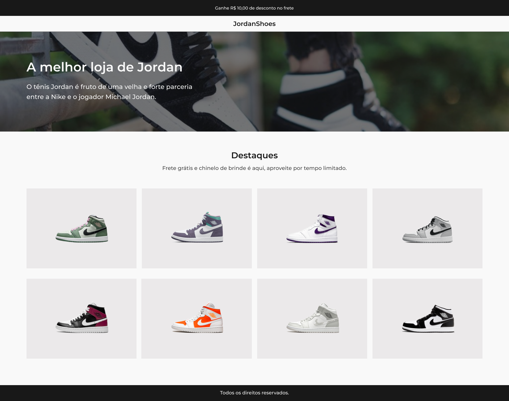

<h1 align="center"> JordanShoes </h1>

  <a href="#-tecnologias">Tecnologias</a>&nbsp;&nbsp;&nbsp;|&nbsp;&nbsp;&nbsp;
  <a href="#-projeto">Projeto</a>&nbsp;&nbsp;&nbsp;|&nbsp;&nbsp;&nbsp;
  <a href="#-layout">Layout</a>&nbsp;&nbsp;&nbsp;|&nbsp;&nbsp;&nbsp;
  <a href="#memo-licença">Licença</a>

  

 

 

## 🚀 Tecnologias

Esse projeto foi desenvolvido com as seguintes tecnologias:

- ReactJS
- TypeScript
- Vite
- Styled Components
- Git e Github
- Figma

## 💻 Projeto

O JordanShoes é um projeto feito através do Desafio 02 da comunidade [Codelandia](https://discord.gg/QevDJqCzaY).

- [Acesse o projeto finalizado, online](https://jordan-shoes-delta.vercel.app/)

## :memo: Licença

Esse projeto está sob a licença MIT.

---

Feito com ♥ by Ana Luisa Santos